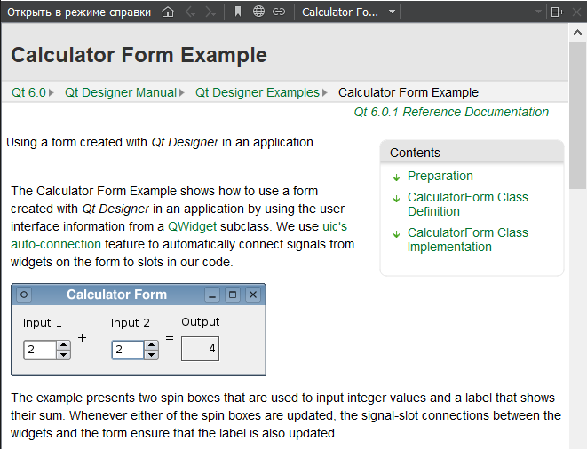
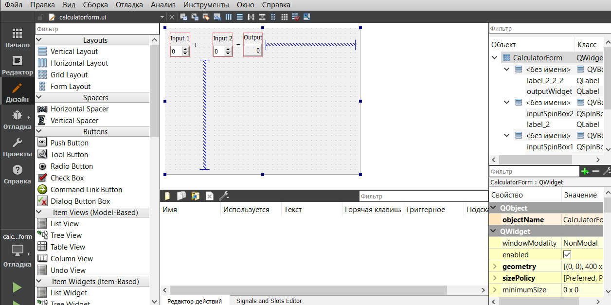
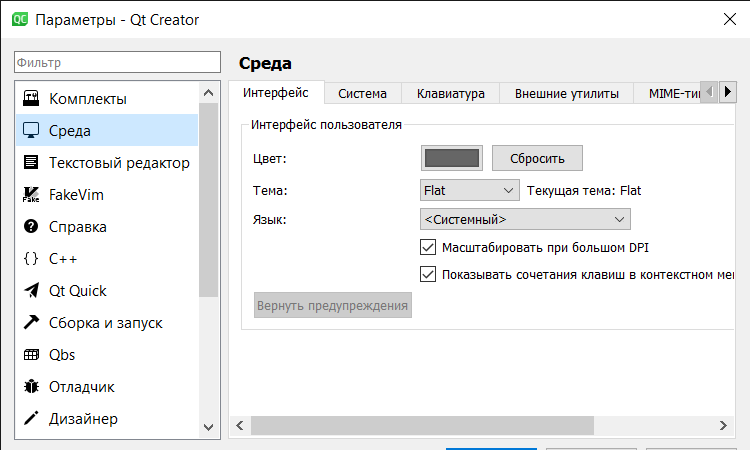
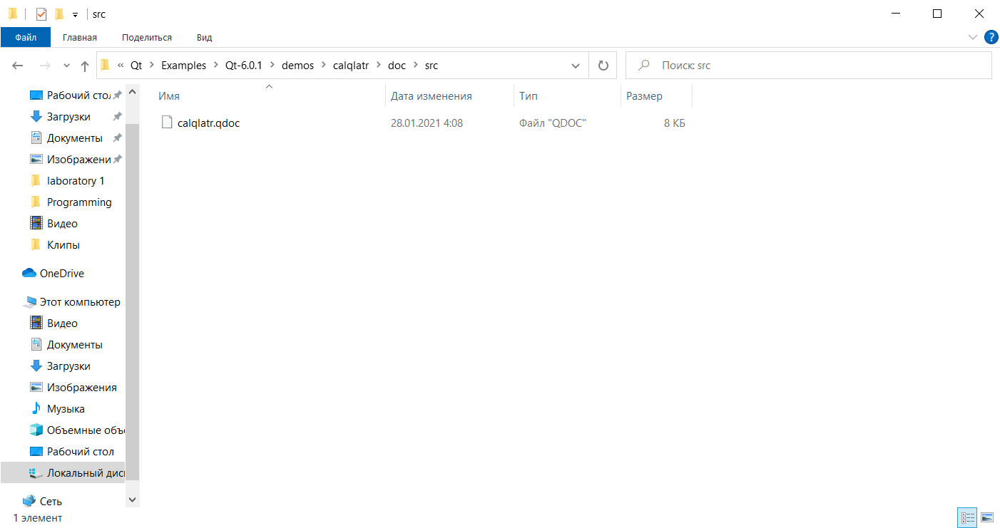
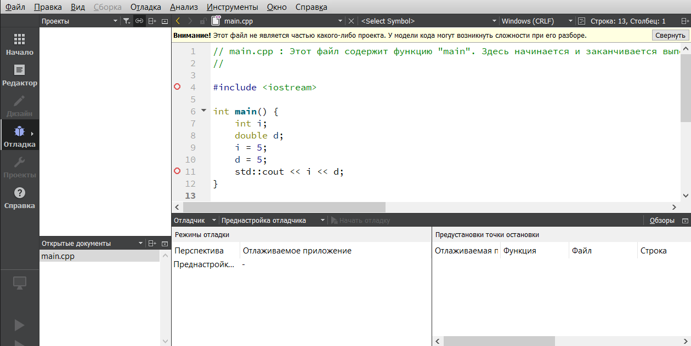

<p align="center">МИНИСТЕРСТВО НАУКИ  И ВЫСШЕГО ОБРАЗОВАНИЯ РОССИЙСКОЙ ФЕДЕРАЦИИ<br>
Федеральное государственное автономное образовательное учреждение высшего образования<br>
"КРЫМСКИЙ ФЕДЕРАЛЬНЫЙ УНИВЕРСИТЕТ им. В. И. ВЕРНАДСКОГО"<br>
ФИЗИКО-ТЕХНИЧЕСКИЙ ИНСТИТУТ<br>
Кафедра компьютерной инженерии и моделирования</p>
<br>
<h3 align="center">Отчёт по лабораторной работе № 4<br> по дисциплине "Программирование"</h3>
<br><br>
<p>студента 1 курса группы ИВТ-б-о-202(2)<br>
Бекбаев Ийстэел Азизович<br>
направления подготовки 09.03.01 "Информатика вычислительная техника"</p>
<br><br>
<table>
<tr><td>Научный руководитель<br> старший преподаватель кафедры<br> компьютерной инженерии и моделирования</td>
<td>(оценка)</td>
<td>Чабанов В.В.</td>
</tr>
</table>
<br><br>
<p align="center">Симферополь, 2021</p>
<hr>

## Цель работы

1.  Установить фреймворк Qt;
2.  Изучить основные возможности создания и отладки программ в IDE Qt Creator.

## Постановка задачи

Настроить рабочее окружение, для разработки программного обеспечения при помощи Qt и IDE Qt Creator, а также изучить базовые возможности данного фреймворка.

## Выполнение работы
<h2 align="center"> Задание 1</h2>
<p align="left">Установил программу  и ознакомился с формами работы в QT на основе шаблона калькулятора(Рис.1 и Рис.2).</p>
<p align="center">  </p>

<p align="center">Рисунок 1 - Мануал по калькулятору <br>

<p align="center">  </p>

<p align="center">Рисунок 2 - Дизайн калькулятора <br>

<h2 align="center">Задание 2</h2>
<p align="left">1. Как изменить цветовую схему (оформление) среды? </p>
<p>Необходимо зайти в настройки редактора и найти параметр "среда", там можно изменить настройки среды при помощи ползунков(Рис.3).</p>

<p align="center">  </p>

<p align="center">Рисунок 3 - Изменение цветовой схемы <br>

<p align="left">2.  Как закомментировать/раскомментировать блок кода средствами Qt Creator? Имеется ввиду комбинация клавиш или пункт меню. </p>
<p>Как и с настройками цветовой схемы, необходимо зайти в настройки редактора и найти параметр "среда", там также есть и  настройки клавиш.</p>

<p align="left">3. Как открыть в проводнике Windows папку с проектом средствами Qt Creator? </p>
<p>Необходимо зайти в папку, где создан код и найти файл в src с разрешением "qdoc"(Рис.4).</p>
<p align="center">  </p>

<p align="center">Рисунок 4 - Файл ".qdoc" <br>

<p align="left">4. Какое расширение файла-проекта используется Qt Creator? </p>
<p>При редакторе зачастую используются такие разрешения как pro или qml для визуального программирования.</p>


<p align="left">5. Как запустить код без отладки? </p>
<p>Необходимо найти данный пункт на панели инструменты.</p>

<p align="left">6. Как запустить код в режиме отладки? </p>
<p>На панели имеется нужный пункт, аналогичный тому, как в Visual Studio, однако, при помощи него, можно обращаться к другим частям программы.</p>

<p align="left">7. Как установить/убрать точку останова (breakpoint)?</p>


</p>
<h2 align="center">Задание 3</h2>

<p align="left">Далее, создал консольное приложение без Qt.  И заменил содержимое файла main.cpp на:

```C++
#include <iostream>
int main() {
 int i;
 double d;
 i = 5;
 d = 5;
 std::cout << i << d;
}
```
Переключил режим сборки в режим **Отладка** .Установил точки останова на 6, 7, 8 строках.
Выполнил программу в режиме отладки(Рис.5).
<p align="center">  </p>

<p align="center">Рисунок 5 - Отладка <br>


<h2 align="center">Вывод</h2>
<p align="left">Научился основам работы со средой Qtcreator. На примере калькулятора, рассмотрел методы работы с данной средой. Изучил основные функции среды разработки Qt. </p>
